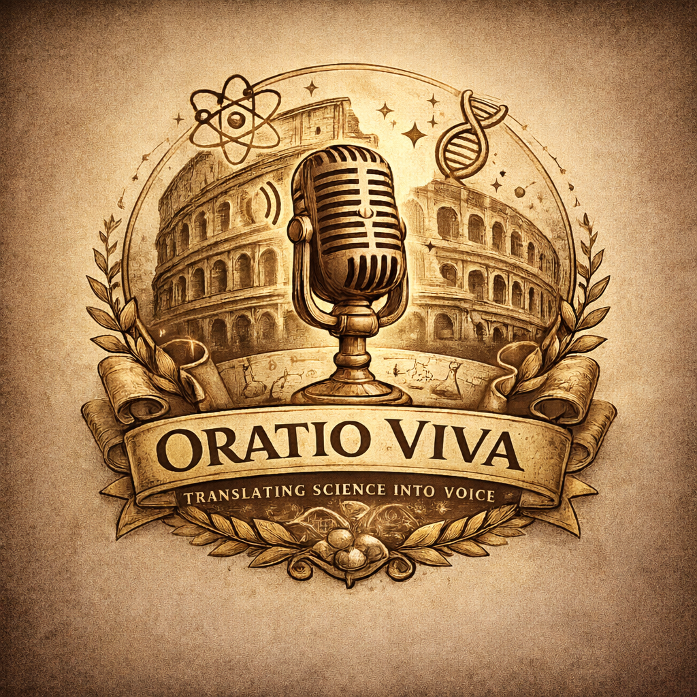

# OratioViva



OratioViva is a Windows desktop text-to-speech (TTS) app that runs locally and
supports multiple models, voice cloning, and batch workflows. This repository
contains the desktop UI, the FastAPI backend, and supporting assets/scripts.

## Getting started (users)

1. Install the Windows build (generated via Tauri).
2. Launch OratioViva and let first-run setup finish (Python + models).
3. Pick a voice, paste text, and click **Generate Audio**.
4. Optional: add a Hugging Face token in Settings to access gated models.

## Repository layout

- `frontend/`: React + Vite + Tauri desktop app
- `backend/`: FastAPI service that handles TTS, models, exports, and jobs
- `scripts/`: helper utilities and generators
- `assets/`: shared assets
- `promo-video/`: promotional video project

## Quick start (development)

Backend (FastAPI):
```bash
cd backend
python -m venv .venv
.venv\Scripts\activate
pip install -r requirements.txt
uvicorn main:app --reload
```

Frontend (Vite + React):
```bash
cd frontend
npm ci
npm run dev
```

Tauri desktop (local app shell):
```bash
cd frontend
npm run tauri:dev
```

## Tests & lint

Backend tests:
```bash
cd backend
pytest -q
```

Frontend tests and lint:
```bash
cd frontend
npm run test
npm run lint
```

## Documentation

- `frontend/README.md` - user-facing app overview and setup
- `backend/README.md` - API/service details
- `QA_CHECKLIST.md` - pre-release QA checklist
- `RELEASE.md` - release process and checklist
